# Cairn Backend Architecture

## Overview

Cairn is a Rust-based backend service for Trackmaker that provides user authentication, route sharing, and cloud synchronization. It follows an **offline-first** design where local storage remains primary and cloud sync is opt-in.

## System Architecture

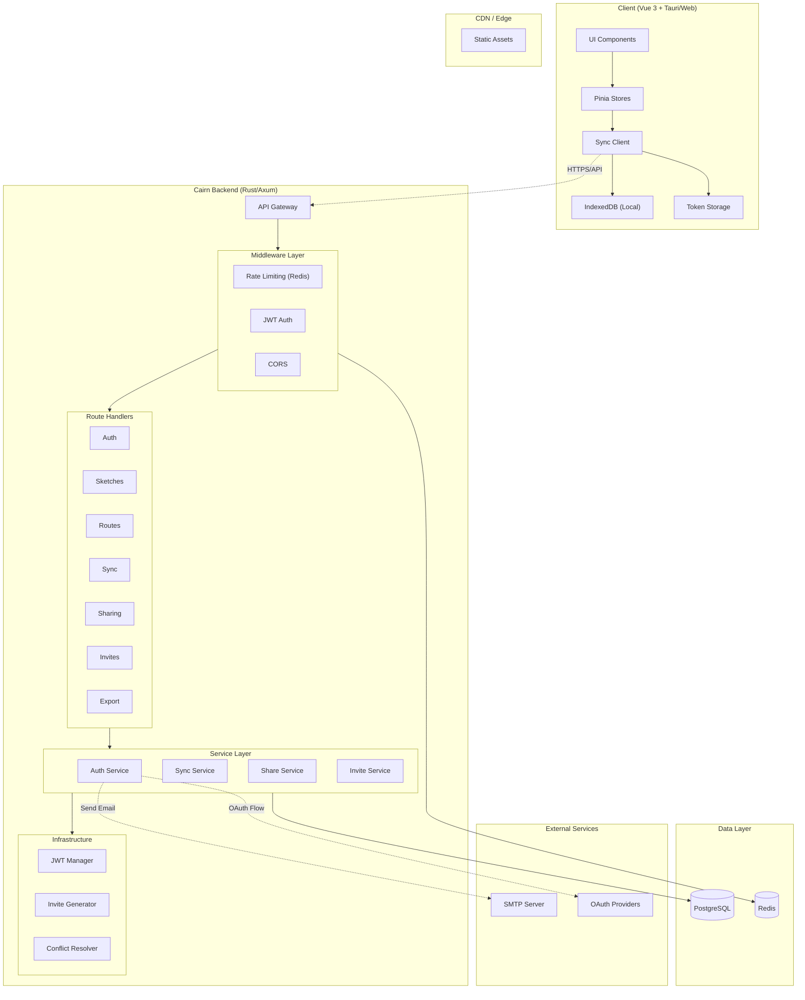

## Database Schema

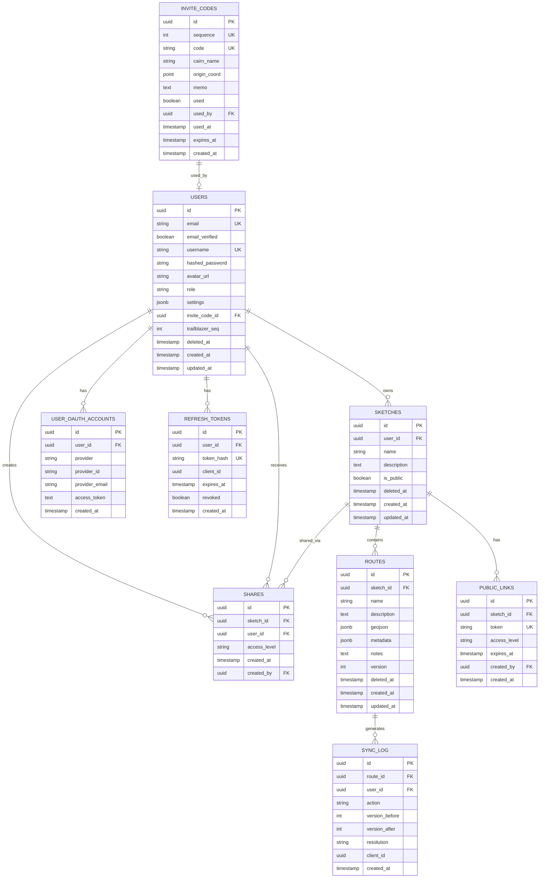

## Authentication Flow

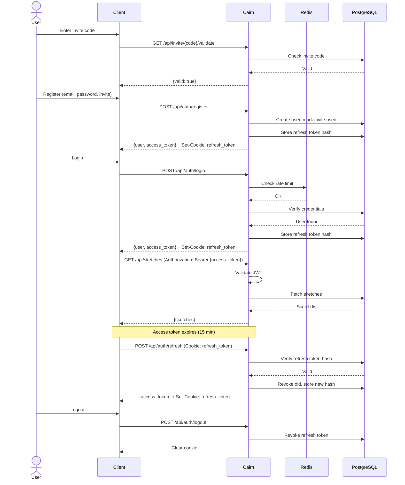

## Sync Flow

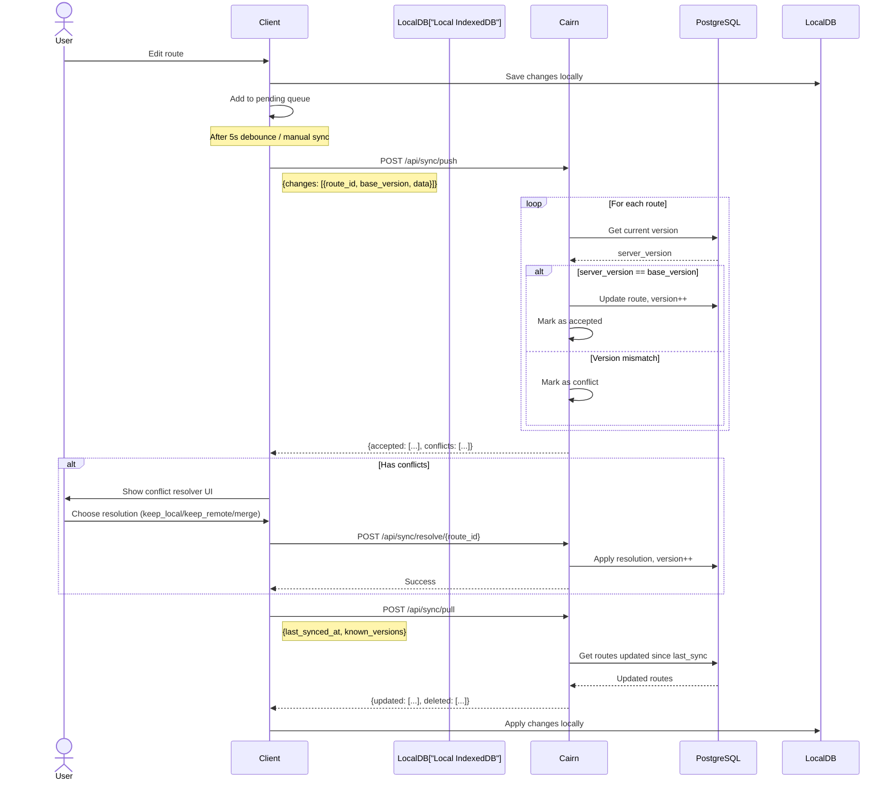

## Sharing Flow

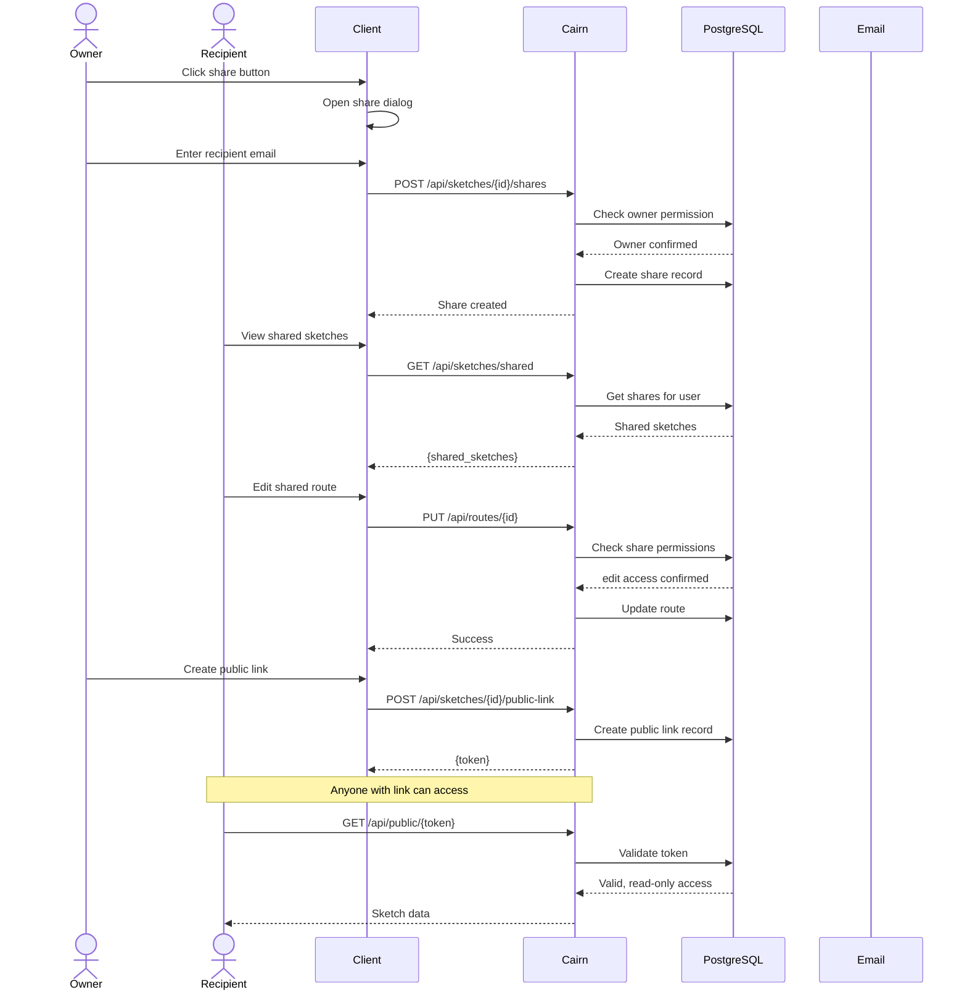

## Module Structure

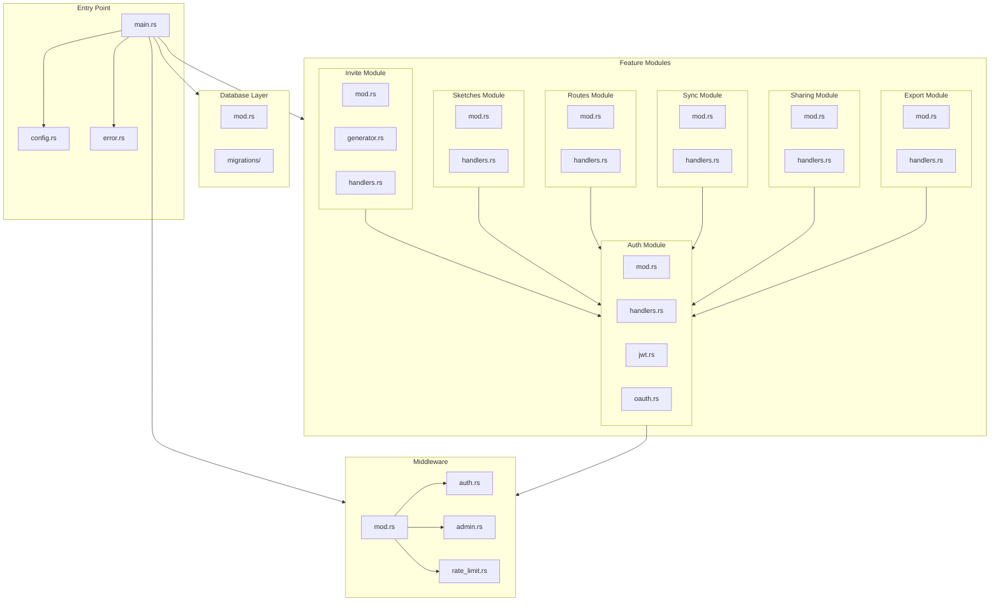

## Request Flow

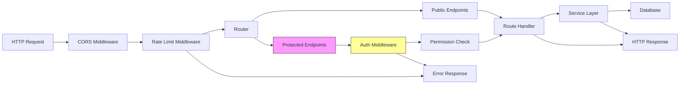

## Data Flow (Offline-First)

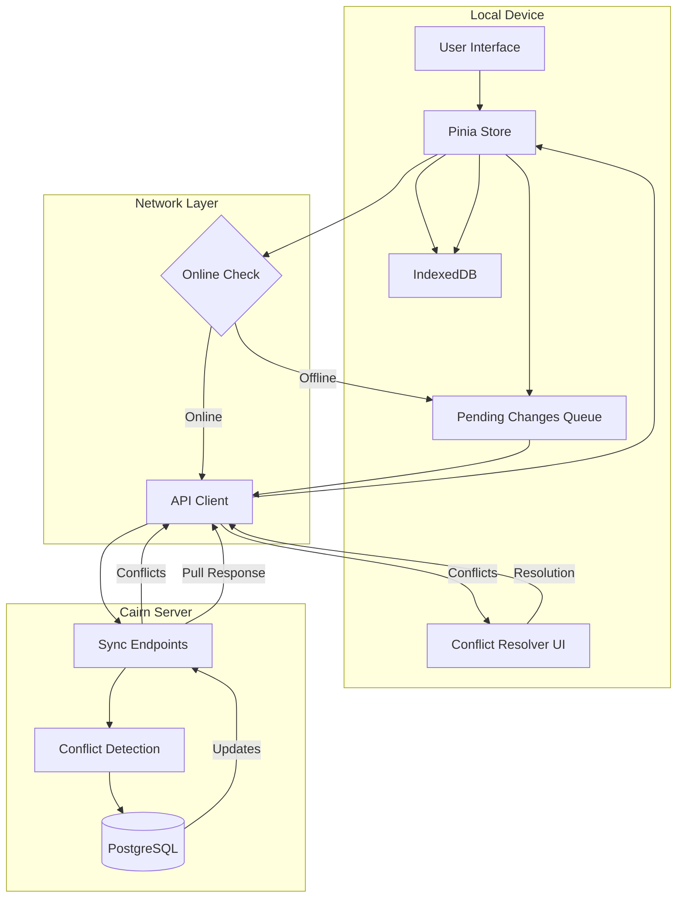

## Security Layers

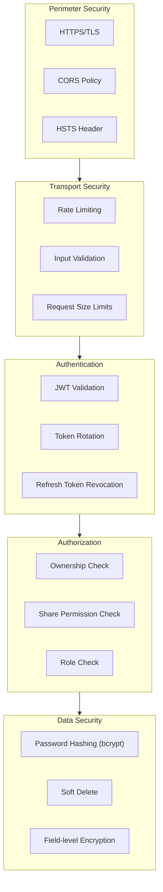

## Deployment Architecture

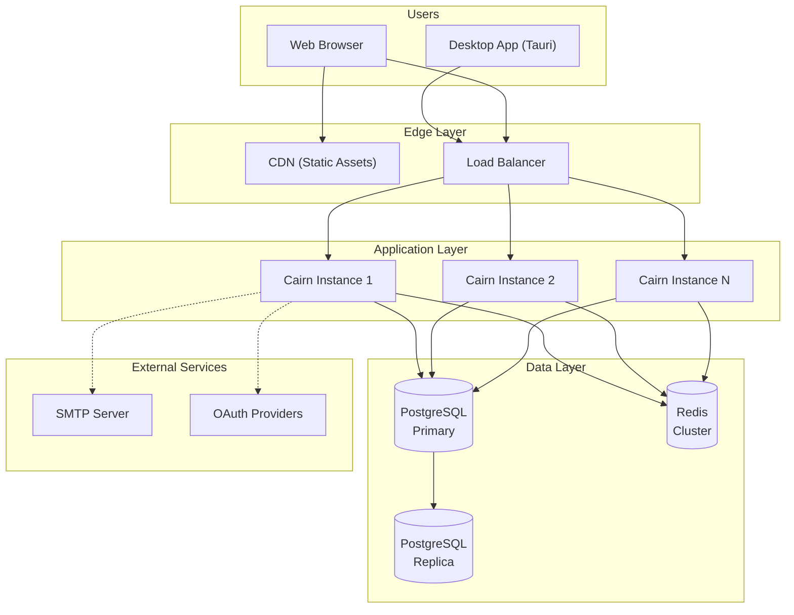

## Technology Stack

| Layer | Technology | Purpose |
|-------|------------|---------|
| **Runtime** | Rust + Tokio | High-performance async runtime |
| **Web Framework** | Axum | HTTP server, routing, middleware |
| **Database** | PostgreSQL | Primary data store |
| **Cache** | Redis | Sessions, rate limiting, token blacklist |
| **ORM** | SQLx | Type-safe SQL with compile-time checks |
| **Auth** | JWT + bcrypt | Token-based auth, password hashing |
| **Serialization** | Serde | JSON handling |
| **Validation** | Validator | Input validation |
| **Logging** | Tracing | Structured logging |
| **Config** | config-rs | Environment-based configuration |

## API Endpoint Structure

```
/api
├── /auth
│   ├── POST /register
│   ├── POST /login
│   ├── POST /logout
│   ├── POST /refresh
│   ├── GET  /me
│   ├── PUT  /me
│   ├── POST /forgot-password
│   ├── POST /reset-password
│   ├── POST /verify-email
│   ├── GET  /oauth/{provider}
│   ├── GET  /oauth/{provider}/callback
│   ├── POST /oauth/{provider}/link
│   └── DELETE /oauth/{provider}/unlink
├── /sketches
│   ├── GET    / (list)
│   ├── GET    /shared (list shared)
│   ├── POST   / (create)
│   ├── GET    /{id} (get)
│   ├── PUT    /{id} (update)
│   ├── DELETE /{id} (delete)
│   ├── GET    /{id}/routes (list routes)
│   ├── POST   /{id}/routes (create route)
│   ├── POST   /{id}/shares (share)
│   ├── GET    /{id}/shares (list shares)
│   ├── POST   /{id}/public-link (create link)
│   └── DELETE /{id}/public-link (revoke link)
├── /routes
│   ├── GET    /{id} (get)
│   ├── PUT    /{id} (update)
│   └── DELETE /{id} (delete)
├── /sync
│   ├── POST /push
│   ├── POST /pull
│   └── POST /resolve/{route_id}
├── /sharing
│   ├── PUT    /sketches/{id}/shares/{user_id}
│   └── DELETE /sketches/{id}/shares/{user_id}
├── /invite
│   └── GET /{code}/validate
├── /admin
│   ├── POST /invites (create)
│   ├── GET  /invites (list)
│   └── DELETE /invites/{id} (revoke)
├── /public
│   └── GET /{token} (access public sketch)
├── /trailblazers
│   └── GET / (list)
└── /export
    ├── POST / (request)
    └── GET  /{job_id} (download)
```

## Key Design Decisions

### 1. Offline-First Architecture
- Local IndexedDB is the source of truth
- Cloud sync is opt-in and additive
- Changes are queued when offline and replayed when connected
- Conflict resolution is manual at the route level

### 2. Route-Level Granularity
- Routes are the atomic unit of sync, not sketches
- Multiple users can edit different routes in the same sketch simultaneously
- Conflicts only occur when the same route is edited concurrently

### 3. Version-Based Optimistic Locking
- Each route has a version counter
- Push includes `base_version` — if server version differs, it's a conflict
- No automatic merging — user decides resolution

### 4. Token Strategy
- Short-lived access tokens (15 min) in memory only
- Long-lived refresh tokens (7 days) in HttpOnly cookies / secure storage
- Refresh tokens are rotated and tracked server-side for revocation

### 5. Soft Delete with Retention
- All deletions are soft (set `deleted_at`)
- 30-day retention before permanent purge
- Allows for data recovery and audit trails

## Scalability Considerations

### Horizontal Scaling
- Stateless application servers (no session state)
- JWT auth allows any instance to validate tokens
- Database is the only shared state

### Database Scaling
- Read replicas for GET endpoints
- Connection pooling via SQLx
- Proper indexing on all query patterns

### Caching Strategy
- Redis for rate limiting counters
- Token blacklist for emergency revocation
- Future: Route-level caching for public links

### Sync Optimization
- Batch push/pull operations
- Delta sync (only changed fields)
- Compression for large GeoJSON payloads

## Monitoring & Observability

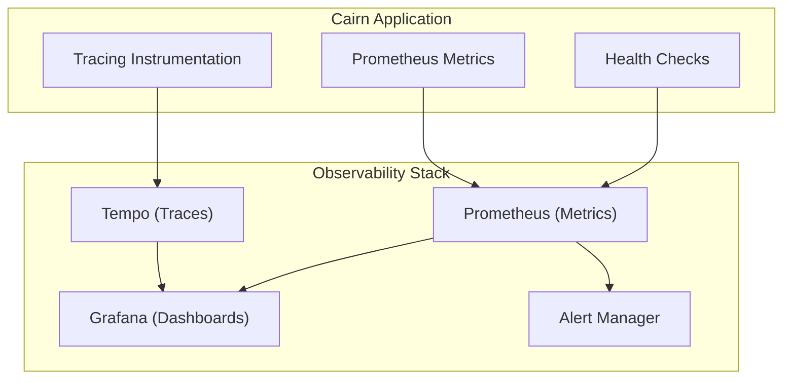

### Key Metrics
- Request latency (p50, p95, p99)
- Error rate by endpoint
- Sync queue depth
- Conflict rate
- Token refresh rate
- Database connection pool usage

## Next Steps

1. **Phase 1**: Core auth, invite system, basic sync
2. **Phase 2**: OAuth, sharing, public links
3. **Phase 3**: Advanced features, optimization

---

*This architecture document serves as the blueprint for implementing the Cairn backend service.*
